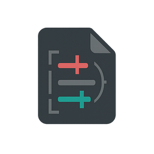

<p align="center">
  
</p>

<h1 align="center">Patch GUI – Diff Applier (PySide6)</h1>

<p align="center">
  App desktop e CLI in <strong>Python + PySide6/Qt</strong> per analizzare e applicare patch <em>unified diff</em> (inclusi blocchi
  <code>*** Begin Patch</code>/<code>*** Update File</code>) direttamente ai file del tuo progetto.
</p>

<p align="center">
  <a href="https://img.shields.io/badge/python-3.10%2B-3776ab?logo=python&logoColor=white"></a>
  <a href="https://img.shields.io/badge/PySide6-6.7.3-41cd52?logo=qt&logoColor=white"></a>
  <a href="LICENSE"></a>
</p>

<p align="center">
  <sub>Supporta incolla da clipboard, ricerca fuzzy, dry-run, backup automatici e report dettagliati.</sub>
</p>

---

## 📚 Indice rapido

- [✨ Perché Patch GUI](#-perché-patch-gui)
- [🚀 Avvio rapido](#-avvio-rapido)
- [📦 Installazione](#-installazione)
- [🧱 Requisiti di sistema](#-requisiti-di-sistema)
- [🧭 Guida all'uso (GUI)](#-guida-alluso-gui)
- [🌐 Internazionalizzazione](#-internazionalizzazione)
- [⚙️ Opzioni e variabili](#-opzioni-e-variabili)
- [🆘 Risoluzione problemi](#-risoluzione-problemi)
- [💾 Struttura di backup & report](#-struttura-di-backup--report)
- [🛠️ Manutenzione dipendenze](#-manutenzione-dipendenze)
- [📝 Note e limitazioni](#-note-e-limitazioni)
- [📜 Licenza](#-licenza)

> Per una guida passo-passo con esempi completi consulta anche [USAGE.md](USAGE.md).

---

## ✨ Perché Patch GUI

- **Sorgente diff flessibile**: carica patch da file, clipboard o textarea integrata.
- **Ricerca intelligente dei file**: matching esatto → fuzzy con soglia configurabile e ricerca ricorsiva.
- **Dry-run con anteprima**: verifica il risultato prima di scrivere su disco.
- **Risoluzione guidata**: dialog interattivo per gestire percorsi ambigui o hunk multipli.
- **Backup automatici**: ogni run reale salva copie timestamped e genera report JSON/TXT.
- **Modalità CLI completa**: `patch-gui apply` replica le capacità della GUI anche in ambienti headless.

---

## 🚀 Avvio rapido

```bash
source .venv/bin/activate
patch-gui  # richiede l'extra "gui"
# oppure
python -m patch_gui
```

> Se hai installato solo la CLI (`pip install .`), utilizza direttamente `patch-gui apply ...`.

### 🧰 Modalità CLI (senza GUI)

```bash
patch-gui apply --root /percorso/al/progetto diff.patch
# oppure
python -m patch_gui apply --root /percorso/al/progetto diff.patch

# Esempi di opzioni
patch-gui apply --root . --dry-run --threshold 0.90 diff.patch
git diff | patch-gui apply --root . --backup ~/diff_backups -
# log dettagliati su stdout
patch-gui apply --root . --dry-run --log-level debug diff.patch
# per disabilitare le richieste interattive in caso di ambiguità
patch-gui apply --root . --non-interactive diff.patch
```

- `--dry-run` analizza senza modificare i file.
- `--threshold` imposta la soglia fuzzy (default `0.85`).
- `--backup` definisce la cartella base per i backup (default `<root>/.diff_backups`).
- `--report-json` / `--report-txt` sovrascrivono i percorsi di output dei report.
- `--no-report` disattiva entrambi i file di report.
- `--non-interactive` mantiene il comportamento storico saltando file ambigui.
- `--log-level` controlla la verbosità (`debug`, `info`, `warning`, `error`, `critical`; default `warning`).
- L'uscita restituisce codice `0` solo se tutti gli hunk vengono applicati con successo.

---

## 📦 Installazione

1. Clona il repository (o scarica il pacchetto) e posizionati nella root del progetto.
2. Crea un ambiente virtuale e installa le dipendenze:

   ```bash
   python3 -m venv .venv
   source .venv/bin/activate
   pip install --upgrade pip
   pip install .        # solo CLI
   # oppure
   pip install .[gui]   # CLI + interfaccia PySide6
   ```

> `pip install .` installa le dipendenze minime per la sola CLI. Usa l'extra `gui` per includere PySide6 e l'interfaccia grafica.

### 💡 VS Code (WSL)

1. Apri la cartella del progetto **dentro WSL** (`code .`).
2. `Ctrl+Shift+P` → **Python: Select Interpreter** → scegli `.venv/bin/python`.
3. (Consigliato) aggiungi `.vscode/settings.json`:

   ```json
   {
     "python.defaultInterpreterPath": ".venv/bin/python",
     "python.analysis.typeCheckingMode": "basic",
     "cSpell.language": "en,it",
     "cSpell.words": [
       "hunk",
       "fuzzy",
       "dry-run",
       "ripristino",
       "anteprima",
       "PySide6",
       "unidiff",
       "WSLg"
     ]
   }
   ```

> Se il pulsante **Run** continua a utilizzare `/usr/bin/env python3`, verifica la configurazione del runner o avvia gli script dal terminale con l'ambiente attivato.

---

## 🧱 Requisiti di sistema

- **WSL Ubuntu** (consigliato; funziona anche su Linux nativo/macOS).
- **Python 3.10+**.
- Dipendenze testate: **PySide6 6.7.3**, **unidiff 0.7.5** (vedi [Manutenzione dipendenze](#-manutenzione-dipendenze)).
- **WSLg** abilitato per visualizzare la GUI Qt su Windows 11/10 21H2+.

Pacchetti utili su Ubuntu/WSL:

```bash
sudo apt update
sudo apt install -y python3 python3-venv python3-pip git \
                    libgl1 libegl1 libxkbcommon-x11-0 libxcb-xinerama0
```

> I pacchetti `libgl1`/`libegl1`/`libxkbcommon-x11-0`/`libxcb-xinerama0` risolvono i tipici errori Qt (plugin `xcb`) negli ambienti WSL.

---

## 🧪 Test

Esegui la suite automatizzata con:

```bash
pytest
```

---

## 🧭 Guida all'uso (GUI)

1. **Root progetto** – seleziona la cartella base: i percorsi nel diff verranno risolti relativamente a questa root.
2. **Carica diff** – apri un `.diff`, incolla dagli appunti o utilizza la textarea → **Analizza testo diff**.
   - Supporta diff standard (`git diff`, `git format-patch`) e blocchi del tipo:

     ```
     *** Begin Patch
     *** Update File: path/file.js
     @@
     -linea vecchia
     +linea nuova
     *** End Patch
     ```
3. **Analizza diff** – il pannello sinistro mostra file e hunk individuati.
4. **Dry-run** – imposta la **soglia fuzzy** (es. `0.85`) e clicca **Applica patch** per simulare l'applicazione.
5. **Applica realmente** – disabilita Dry-run → **Applica patch**.
   - Matching progressivo: **esatto** → **fuzzy**.
   - **Ambiguità**: in presenza di più posizioni plausibili si apre un dialog con tutte le opzioni e relativo contesto.
   - File mancanti: se non trovati sotto la root vengono saltati (comportamento preferito).
6. **Backup & Report** – ogni run reale crea `./.diff_backups/<timestamp>/` con copie originali e genera:
   - `apply-report.json` (strutturato).
   - `apply-report.txt` (leggibile).
7. **Ripristino** – pulsante **Ripristina da backup…** → scegli il timestamp → i file vengono ripristinati.

---

## 🌐 Internazionalizzazione

Il progetto utilizza file di traduzione Qt (`.ts`) in `patch_gui/translations/`.
Durante la build (`pip install .`, `python -m build`, ecc.) viene eseguito automaticamente `python -m build_translations`,
che invoca `lrelease` (o `pyside6-lrelease`) per generare i corrispondenti file `.qm` nella stessa cartella.
I `.qm` restano ignorati da Git ma vengono inclusi nei pacchetti distribuiti.
Se gli strumenti Qt non sono disponibili, l'applicazione ricorre alla compilazione al volo nella cache di Qt.
All'avvio la GUI prova a caricare i `.qm` già presenti e usa `lrelease` solo se assenti o obsoleti.
Sono fornite le traduzioni **inglese** e **italiana**; in assenza di una lingua compatibile l'interfaccia resta in inglese.

### ➕ Aggiungere una nuova lingua

1. Copia `patch_gui/translations/patch_gui_en.ts` in `patch_gui/translations/patch_gui_<codice>.ts` (es. `patch_gui_es.ts`).
2. Aggiorna i blocchi `<translation>…</translation>` mantenendo inalterati i placeholder (es. `{app_name}`).
3. Rigenera i binari con `python -m build_translations` (richiede `lrelease` o `pyside6-lrelease` nel `PATH`).
4. I file `.qm` generati restano ignorati da Git ma verranno inclusi nei pacchetti (`python -m build`, `pip install .`, ecc.).

Per forzare una lingua specifica senza cambiare il locale di sistema, imposta `PATCH_GUI_LANG` prima dell'avvio:

```bash
export PATCH_GUI_LANG=it
patch-gui
```

---

## ⚙️ Opzioni e variabili

- **Soglia fuzzy** – controlla la tolleranza nel confronto del contesto (`difflib.SequenceMatcher`).
- **EOL** – preserva lo stile originale del file (LF/CRLF) al salvataggio.
- **Ricerca file** – prova prima il percorso relativo (rimuovendo prefissi `a/`/`b/`), poi ricerca ricorsiva per nome; in caso di multipli chiede quale usare (CLI non interattiva con `--non-interactive`).
- **Formati supportati** – file di testo generici (JS, TS, HTML, CSS, MD, Rust, …).
- **Logging**:
  - `PATCH_GUI_LOG_LEVEL` controlla la verbosità (`DEBUG`, `INFO`, `WARNING`, `ERROR`, `CRITICAL`, oppure valori numerici come `20`). Default `INFO`.
  - `PATCH_GUI_LOG_FILE` imposta il percorso del file di log (es. `~/logs/patch_gui.log`). Default `~/.patch_gui.log`.

```bash
# Avvio della GUI con log dettagliati nel percorso di default (~/.patch_gui.log)
PATCH_GUI_LOG_LEVEL=DEBUG patch-gui

# Modalità CLI con log personalizzato
PATCH_GUI_LOG_FILE="$HOME/logs/patch_gui-app.log" PATCH_GUI_LOG_LEVEL=WARNING \
  patch-gui apply --root . diff.patch
```

---

## 🆘 Risoluzione problemi

### `ModuleNotFoundError: No module named 'unidiff'`

- Assicurati di aver **attivato il virtualenv** prima dell'esecuzione:

  ```bash
  source .venv/bin/activate
  python -c "import sys; print(sys.executable)"
  pip show unidiff
  ```

  Se `pip show` non trova il pacchetto:

  ```bash
  pip install unidiff
  ```

- In **VS Code**, seleziona l'interprete `.venv/bin/python`. Se il runner usa ancora `/usr/bin/env python3`, lancia gli script dall'Integrated Terminal con venv attivo.

### Errori Qt (plugin `xcb`, display, ecc.) su WSL

- Installa i pacchetti di sistema elencati in [Requisiti](#-requisiti-di-sistema).
- Verifica che **WSLg** sia attivo (di default su Windows 11). Senza WSLg puoi usare un X-Server esterno, ma non è consigliato.

### Avvisi Pylance/typing

- Il progetto è già tipizzato per ridurre i warning. Se preferisci una modalità più permissiva:

  ```jsonc
  // .vscode/settings.json
  {
    "python.analysis.typeCheckingMode": "basic"
  }
  ```

- In caso di falsi positivi su librerie senza type stubs (es. `unidiff`), il codice utilizza annotazioni conservative (`Any`) dove necessario.

### Code Spell Checker (cSpell) e testo in italiano

Aggiungi l'italiano e alcune parole tecniche:

```json
{
  "cSpell.language": "en,it",
  "cSpell.words": ["hunk", "ripristino", "anteprima", "ricorsiva", "similarità", "WSLg", "PySide6", "unidiff"]
}
```

---

## 💾 Struttura di backup & report

```
.diff_backups/
  2025YYYYMMDD-HHMMSS/
    path/del/file/originale.ext
    apply-report.json
    apply-report.txt
```

---

## 🛠️ Manutenzione dipendenze

Le versioni correnti verificate sono:

- `PySide6==6.7.3` (extra opzionale `gui`: Qt for Python 6.7 LTS, compatibile con Python 3.10–3.12 e con fix di stabilità per i dialoghi su Linux).
- `unidiff==0.7.5`.

### Procedura di aggiornamento (PySide6 / unidiff)

1. **Studia la compatibilità**
   - Consulta le note di rilascio di Qt for Python per verificare il supporto rispetto alla baseline (`Python 3.10+`).
   - Controlla il changelog di `unidiff` (GitHub/PyPI) per eventuali breaking change.
2. **Prepara un ambiente pulito**

   ```bash
   python3 -m venv .venv-upgrade
   source .venv-upgrade/bin/activate
   python -m pip install --upgrade pip
   ```

3. **Installa le versioni candidate** (sostituisci `<versione>` con la release da testare)

   ```bash
   pip install PySide6==<versione> unidiff==<versione>
   ```

4. **Esegui gli smoke test**
   - Compila i moduli del progetto per intercettare errori di import: `python -m compileall patch_gui`.
   - Avvia l'app (`python -m patch_gui`) e verifica con un diff di esempio: caricamento, dry-run, applicazione reale, ripristino da backup.
5. **Aggiorna i file di progetto**
   - Aggiorna le versioni in `requirements.txt` (e nel `pyproject.toml` se aggiungi vincoli).
   - Esegui `pip freeze` o aggiorna la documentazione se necessario.
6. **Documenta il cambiamento**
   - Aggiorna questa sezione del README con le nuove versioni supportate e i test eseguiti.

Concludi disattivando l'ambiente di prova con `deactivate` e rimuovendo la virtualenv temporanea.

---

## 📝 Note e limitazioni

- L'app **non** modifica file binari.
- Per diff di grandi dimensioni, anteprima e ricerca potrebbero richiedere più tempo.

---

## 📜 Licenza

Distribuito con licenza [MIT](LICENSE). Consulta il file `LICENSE` per il testo completo.
